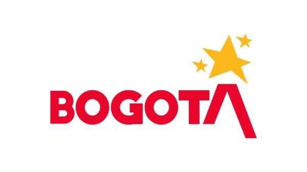
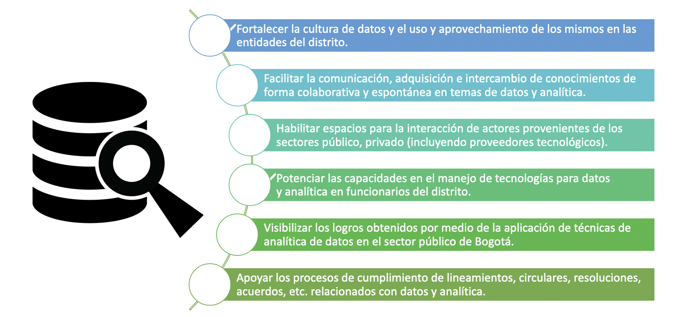
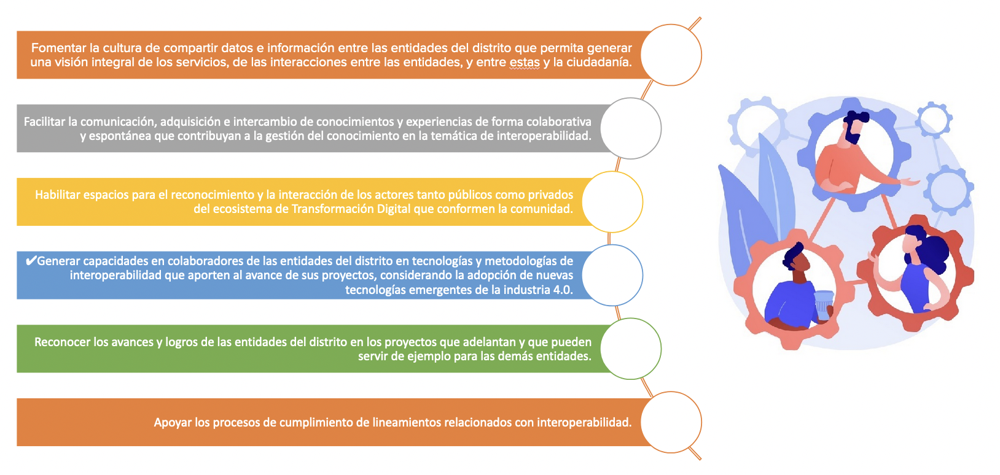
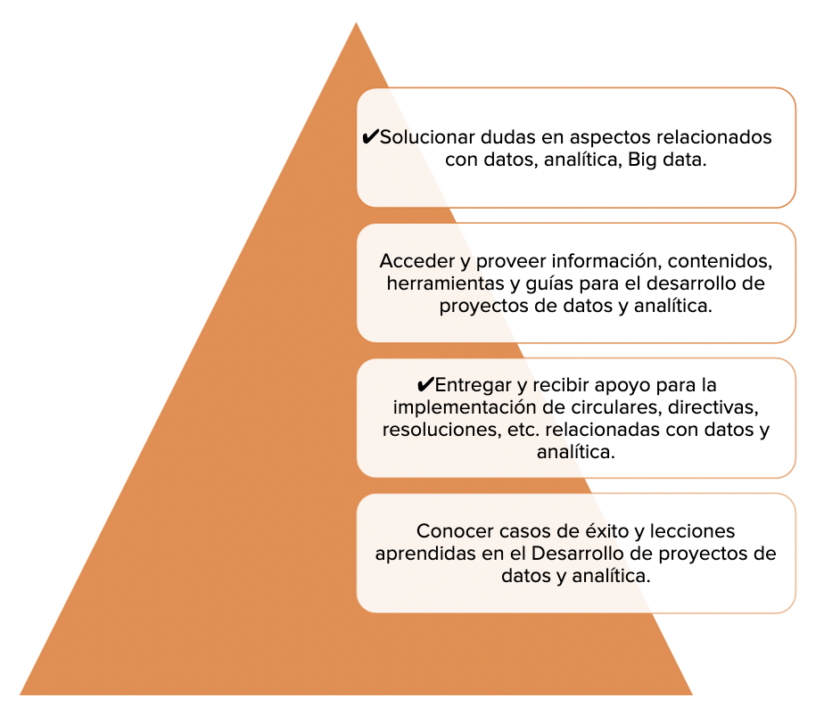
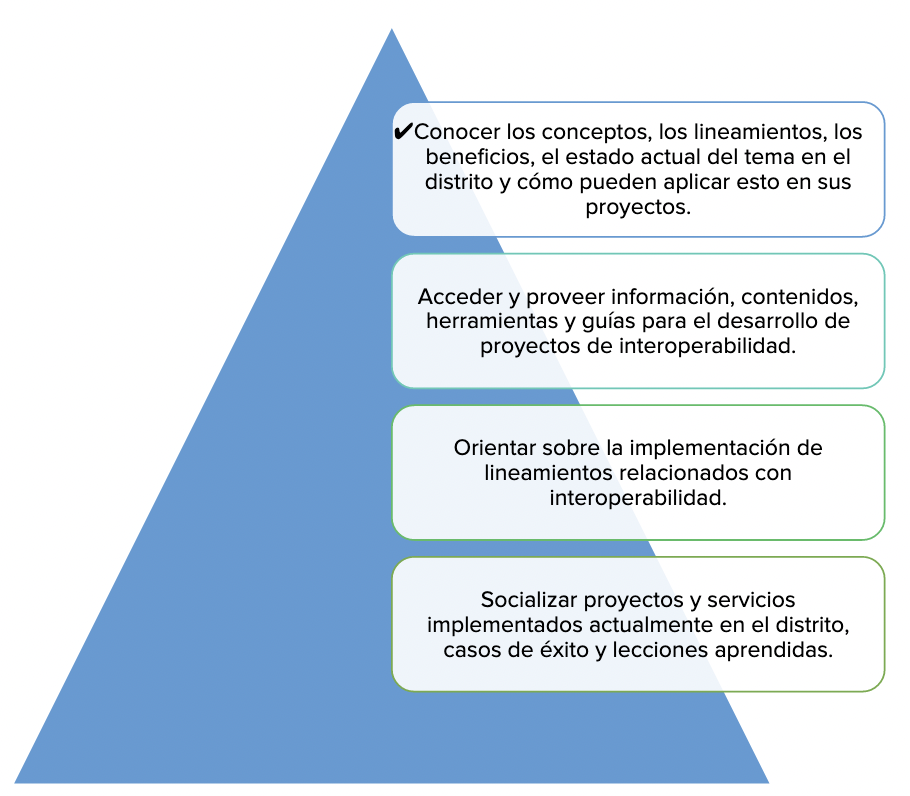
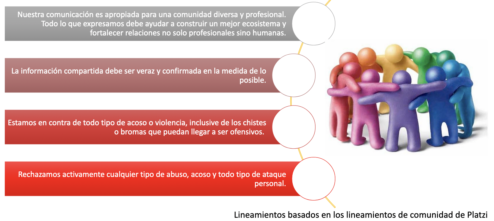
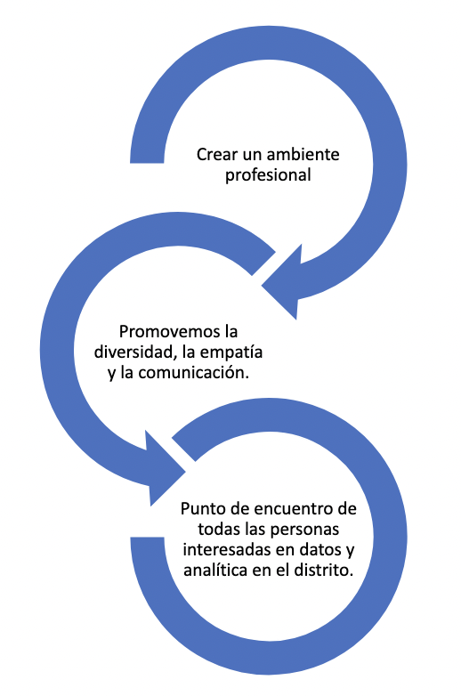

# Comunidad de Analítica e Interoperabilidad del Distrito

    

## Propósito de la Comunidad de Analítica e Interoperabilidad
Apoyar procesos de transformación digital en las entidades del distrito capital, en temas relacionados con datos, analítica e interoperabilidad, en un ambiente colaborativo, seguro y de respeto.

    

## Objetivos de la Comunidad de Analítica e Interoperabilidad

    
    

## Propuesta de valor de la Comunidad de Analítica e Interoperabilidad del Distrito
La comunidad será un espacio colaborativo, dinámico y seguro para:
Co-crear soluciones a necesidades comunes de las entidades del distrito.

La comunidad será un espacio colaborativo, dinámico y seguro para:

Generar redes de conocimiento, compartir experiencias y adquirir las capacidades necesarias por parte de los colaboradores de las entidades del distrito, para el desarrollo de proyectos de interoperabilidad que ayuden a mejorar los servicios que ofrecen y llegar a tener una visión integral de los servicios públicos y privados, de las interacciones entre las entidades, y entre estas y la ciudadanía.

<table style="border:none;">
    <tr>
        <td>
            

                
            

        </td>
        <td>
            

                
            

        </td>
    </tr>
</table>

## Audiencia de la Comunidad de Analítica e Interoperabilidad
En general, corresponden a las Entidades distritales: Servidores públicos y colaboradores de diferentes sectores del distrito y de áreas interdisciplinarias tales como planeación, comunicación, información, datos, investigación, funcionales, tecnología, interesados o relacionados con actividades de intercambio de información con otras entidades.
## Herramientas y proceso para vincularse a la Comunidad de Analítica e Interoperabilidad del Distrito 
Se crea un espacio en Slack para la comunidad:
https://join.slack.com/t/comunidaddeanaltica/shared_invite/zt-184wrvjno-reoqs~pCw0HTn5BLaPmM5Q.

Se conecta con un repositorio en GitHub para gestionar la documentación que se genere en la comunidad

## Lineamientos* de la Comunidad de Analítica del Distrito (Código de Conducta)
-
Table
Estamos comprometidos con el cumplimiento de nuestros lineamientos y alentamos a la comunidad a que comunique cualquier falta o situación que vaya en contra de este código de conducta.

## Metas de la Comunidad de Analítica e Interoperabilidad 
Las siguientes corresponden a las metas de la Estrategia de Uso y Apropiación de la Comunidad de Interoperabilidad para la vigencia 2022:

[Únete a la comunidad aquí](https://join.slack.com/t/comunidaddeanaltica/shared_invite/zt-184wrvjno-reoqs~pCw0HTn5BLaPmM5Q)